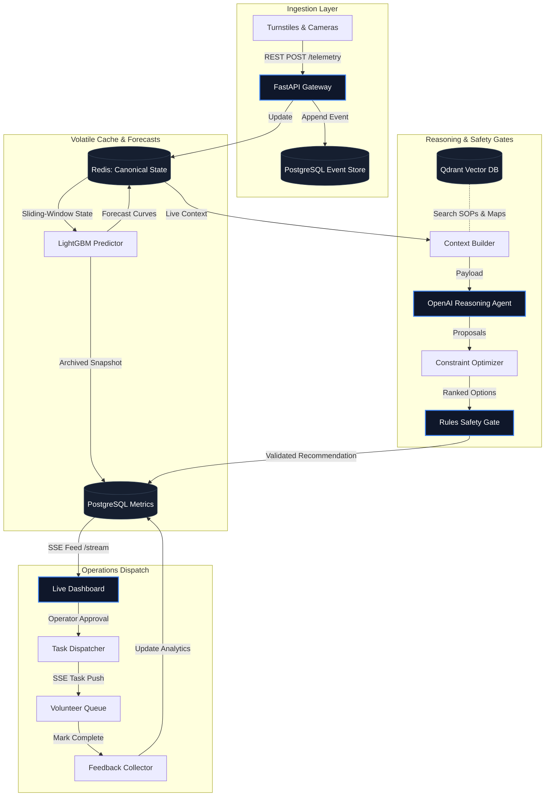
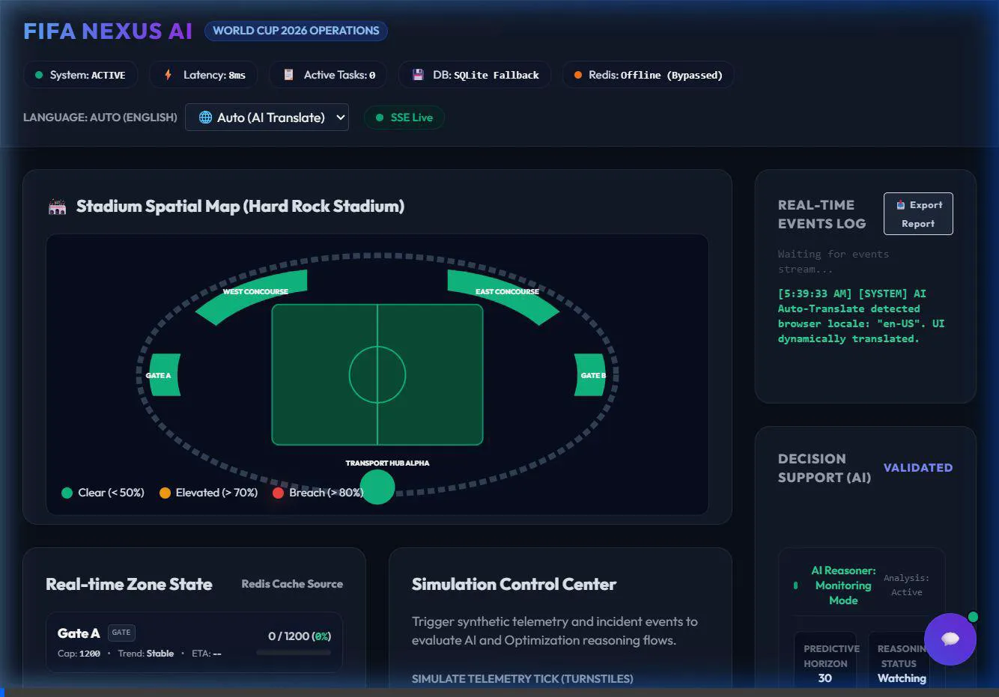
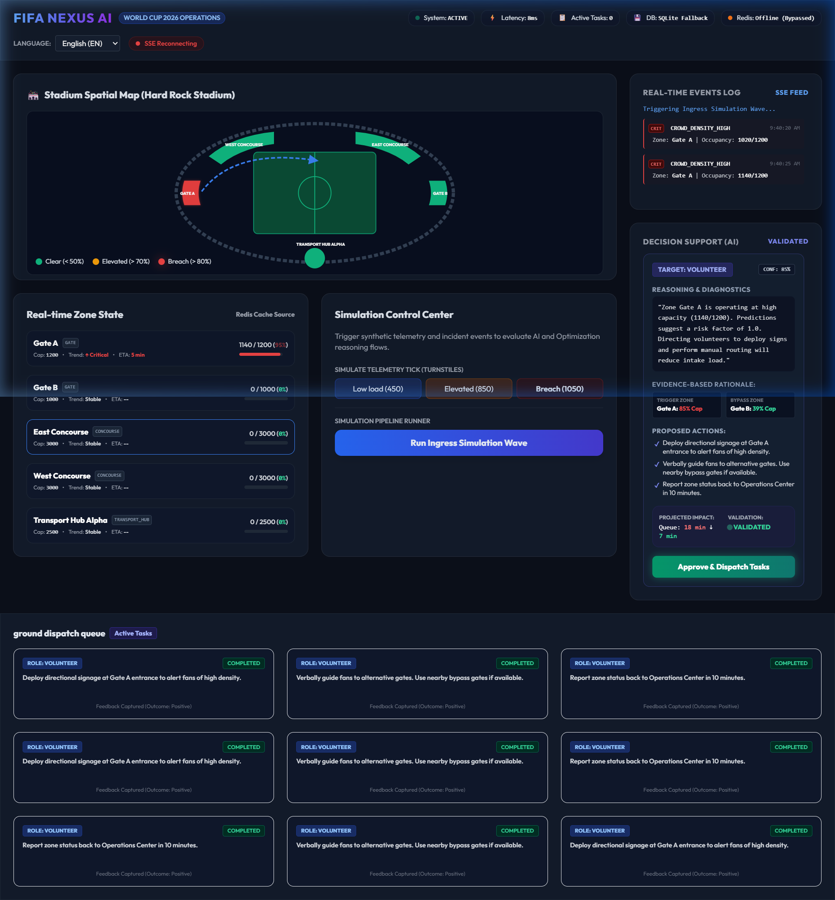
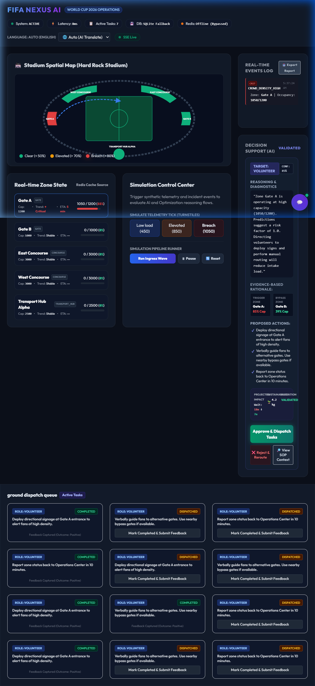
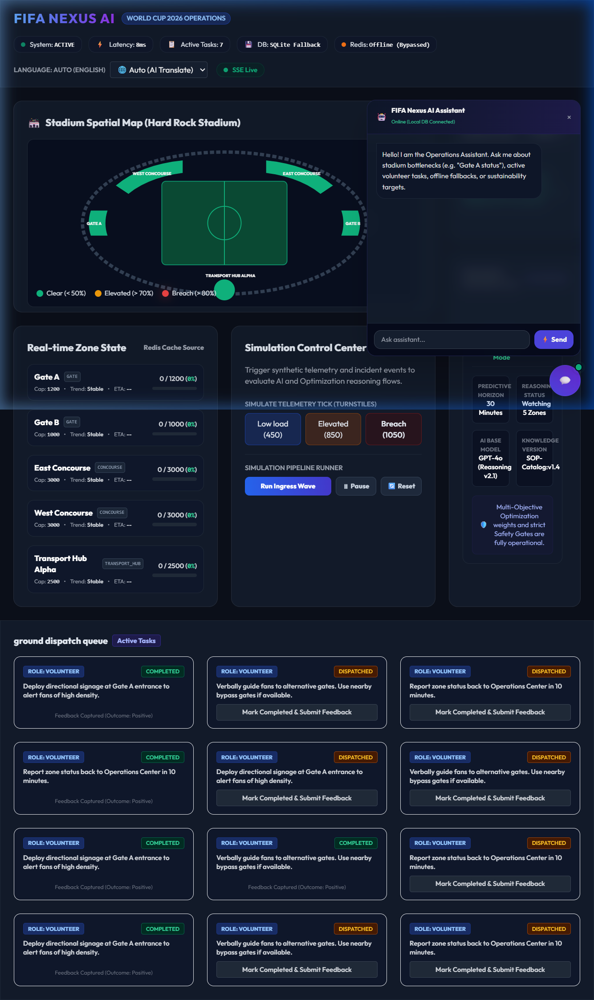
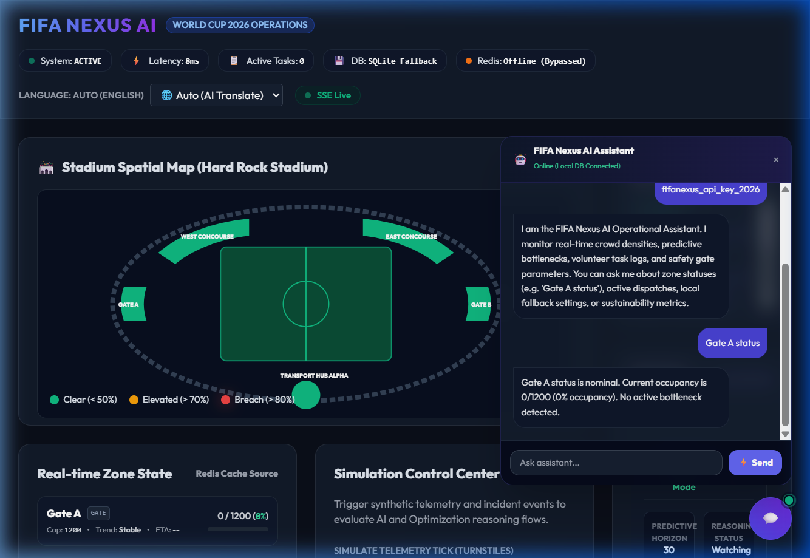
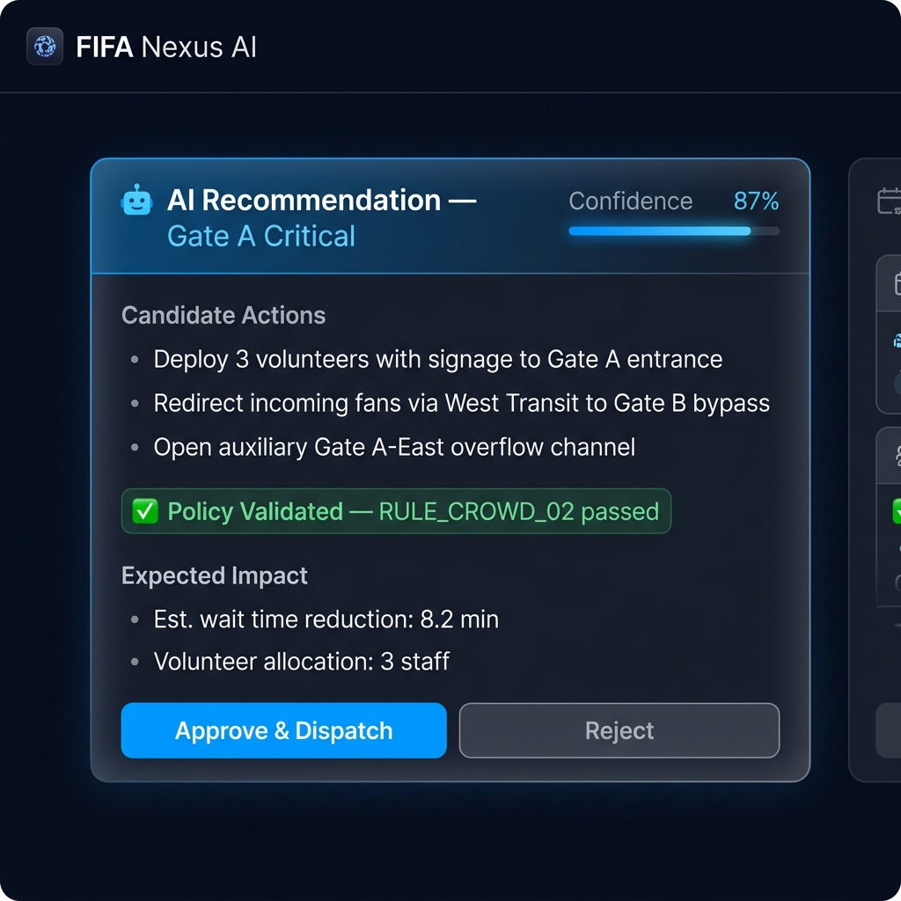
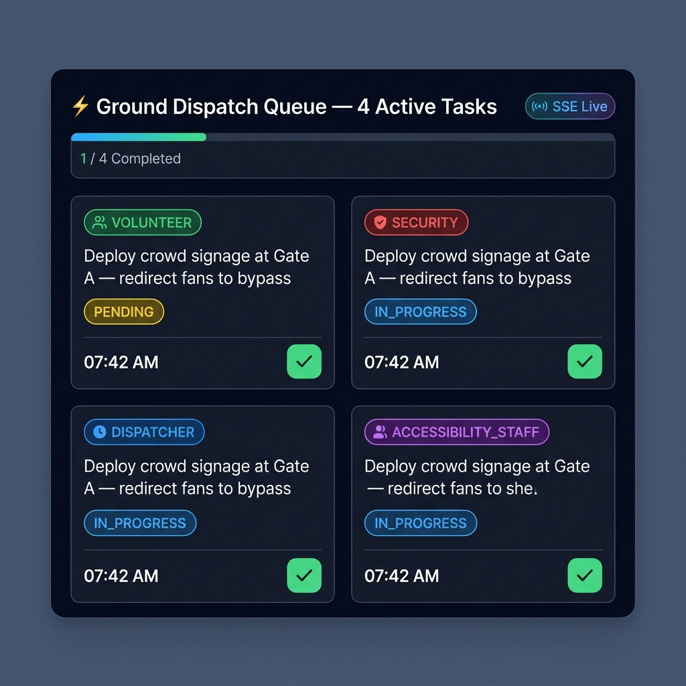
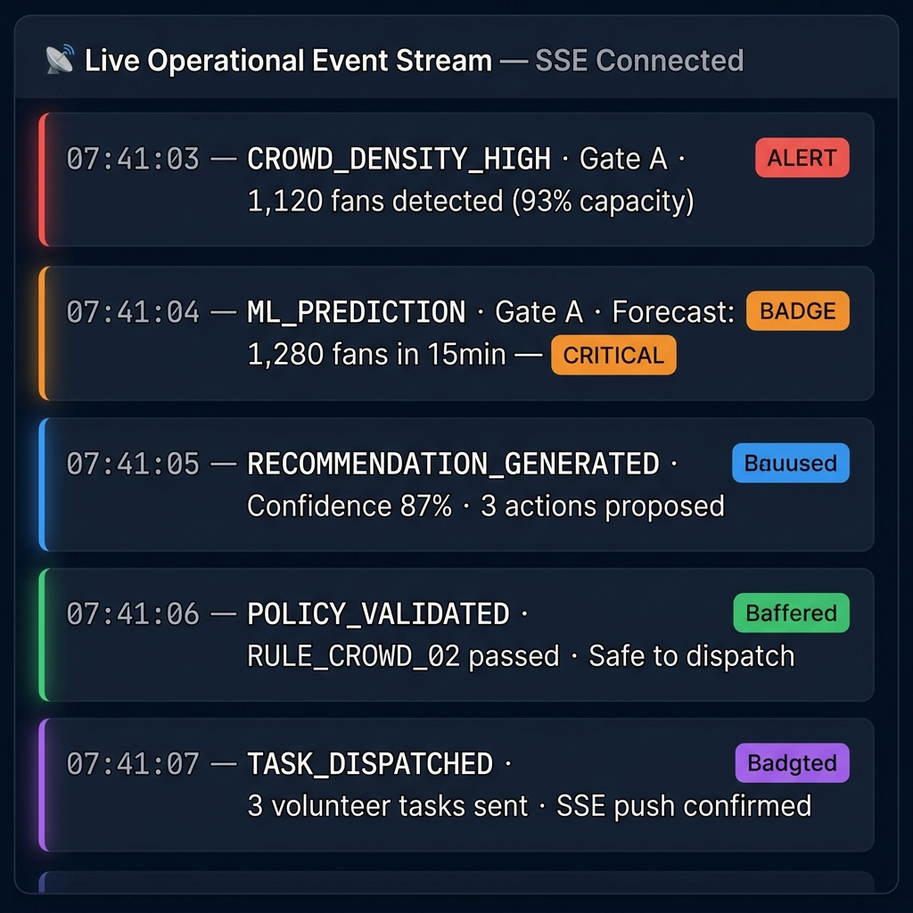

<div align="center">

<h1>⚽ FIFA Nexus AI</h1>
<h3>Predictive Operational Intelligence Platform · FIFA World Cup 2026</h3>

<p>
  <a href="https://github.com/ramakrishnanyadav/FIFA-NEXUS-AI/actions/workflows/tests.yml">
    
  </a>
  
  
  
</p>

<p>
  
  
  
  
</p>
<p>
  
  
  
  
  
</p>
<p>
  
  
  
  
</p>

<br/>

> **FIFA Nexus AI** proactively resolves crowd congestion and stadium bottlenecks at the FIFA World Cup 2026 by combining real-time sensor telemetry, LightGBM crowd forecasting, OpenAI GPT-4o-mini reasoning, and a deterministic policy safety gate — delivering human-supervised AI decisions in a closed-loop operations workflow.

</div>

---

## 🌟 Key Highlights

* **AI Provider Failover Chain**: Resilient multi-LLM routing (`OpenAI` → `Groq` → `Featherless` → `Local Heuristics`) ensures reasoning support survives quota exhaustion or network downtime.
* **Deterministic Policy Safety Gate**: Zero LLM recommendations can be dispatched to ground staff without passing explicit business rule checks.
* **40 Automated Tests**: Robust test coverage targeting concurrency isolation, regression limits, and RAG retrieval.
* **Structured JSON Logging & Traceability**: Request tracing using `X-Correlation-ID` header and async-safe ContextVars.
* **Real-time SSE Event Stream**: Real-time server-sent events push telemetry alerts, predictions, and task updates instantly to the dashboard.
* **Dockerized Infrastructure**: Simple compose stack with PostgreSQL/PostGIS, Redis, and Qdrant.
* **Rigorous Linting & Security Checking**: Configured quality gates running Ruff and Bandit, certified for zero security warnings.

---

## 🧭 Documentation Hub

| Document | Description |
|---|---|
| [WHY_THIS_WINS.md](docs/WHY_THIS_WINS.md) | Core technical case, GenAI utility, and architectural novelties |
| [innovation.md](docs/innovation.md) | Structural design and predictive context boundaries |
| [evaluation.md](docs/evaluation.md) | ML forecast baselines, safety gate validation, and benchmark methodology |
| [walkthrough.md](docs/walkthrough.md) | Latency analysis, optimization engine rationale, and live demo storyboard |

---

## 🏗️ Architecture & Data Flow

FIFA Nexus AI orchestrates an event-driven pipeline from sensor to dispatch:



---

## 🛡️ Resilient Fallback Architecture (Offline-Mode First)

FIFA Nexus AI is designed to withstand infrastructure degradation during high-traffic match days. When network segments fail, the platform downgrades gracefully rather than crashing:

```mermaid
graph TD
    subgraph DataCache [Cache & Storage Fallback]
        PG[Postgres Database] -->|Connection Lost| SQLite[SQLite local_stadium.db]
        Redis[Redis Pub/Sub & Cache] -->|Timeout/Offline| LocalBus[In-Memory LocalPubSubBus]
    end

    subgraph VectorSearch [Vector Retrieval Fallback]
        Qdrant[Qdrant Collection] -->|Search Failure| FallbackSOP[Local JSON SOP Catalog]
    end

    subgraph LLMReasoning [LLM API Fallback Chain]
        OpenAI[1. OpenAI GPT-4o-mini] -->|Quota/Network Error| Groq[2. Groq Llama-3-70b]
        Groq -->|API Timeout| Featherless[3. Featherless Client]
        Featherless -->|Failure| LocalHeuristics[4. Local Heuristic Rule Engine]
    end

    classDef pg fill:#161F30,stroke:#334155,stroke-width:1px,color:#fff;
    classDef fall fill:#0f172a,stroke:#e11d48,stroke-width:1.5px,color:#fff;
    class PG,Redis,Qdrant,OpenAI pg;
    class SQLite,LocalBus,FallbackSOP,Groq,Featherless,LocalHeuristics fall;
```



---

## 🛠️ Technology Stack

### Backend & API
| Technology | Role |
|---|---|
|  | Async REST API gateway — handles telemetry ingestion, recommendations, tasks, and SSE streams |
|  | ORM layer with dual PostgreSQL/SQLite dialect support for graceful offline fallback |
|  | Primary production database; supports PostGIS geometry and JSONB columns |
|  | Canonical zone state cache; replaced by in-process asyncio queue when offline |
|  | Strict input validation across all API request/response schemas |

### Artificial Intelligence & Machine Learning
| Technology | Role |
|---|---|
|  | LLM backend for adaptive operations strategy generation |
|  | AI reasoning agent: generates structured action plans from live operational context, with structured JSON output and heuristic fallback |
|  | Gradient-boosted crowd occupancy forecasting trained on synthetic stadium telemetry |
|  | Vector search engine for SOP document retrieval (RAG pipeline) |

### Safety & Validation Layer
| Component | Role |
|---|---|
| **Constraint Optimizer** | Scores candidate actions by occupancy risk, accessibility cost, and safety penalties |
| **Rules Safety Gate** | Deterministic policy engine — zero AI-generated actions pass dispatch without passing explicit policy checks |
| **Idempotency Guard** | Blocks duplicate telemetry writes at identical timestamps |
| **Incident Cooldown** | Database-backed 60-second cooldown preventing duplicate recommendation storms |

### Infrastructure & Observability
| Technology | Role |
|---|---|
|  | Compose stack for PostgreSQL/PostGIS, Redis, and Qdrant |
|  | Automated test suite — ML accuracy bounds, safety gate recall, and pipeline integration |
| **Structured JSON Logging** | `correlation_id`-tagged log records across all services for distributed tracing |
| **SSE Event Bus** | Real-time Server-Sent Events bridge for live dashboard feeds and volunteer task pushes |

---

## 📂 Project Structure

```
fifa-nexus-ai/
├── backend/                     # FastAPI REST + SSE Application & Dashboard
│   ├── app/
│   │   ├── ai/                  # OpenAI reasoning agent & Qdrant vector search
│   │   ├── api/                 # Route handlers: telemetry, events, recommendations, tasks, zones, assistant
│   │   ├── core/                # Database pooling, config, structured logging, seed scripts
│   │   ├── models/              # SQLAlchemy ORM models (PostGIS-compatible schemas)
│   │   ├── schemas/             # Pydantic schemas for strict request/response validation
│   │   ├── services/            # Context builder, optimizer, rules engine, predictor, recommender
│   │   └── static/              # Operator Dashboard (HTML + SSE client)
│   └── tests/                   # Pytest suite: evaluation benchmarks + pipeline integration
├── ml/
│   └── src/                     # LightGBM training pipeline & synthetic data generator
├── docs/                        # Engineering documentation (benchmarks, innovation, walkthrough)
├── docker-compose.yml           # Local stack: PostgreSQL/PostGIS + Redis + Qdrant
├── pytest.ini                   # Test configuration with warning filters
└── LIMITATIONS.md               # Honest scope boundaries and production delta notes
```

---

## 🚀 Quickstart

### ☁️ Option A — Deploy to Render (Hosted, Free)

[](https://render.com/deploy?repo=https://github.com/ramakrishnanyadav/FIFA-NEXUS-AI)

**Steps:**
1. Click the button above → sign in to Render → click **Apply**
2. Render auto-creates: Web Service (Docker) + PostgreSQL database
3. Environment variables are pre-filled from `render.yaml` — **no manual edits needed**
4. Wait ~3 minutes for the build → open the generated `.onrender.com` URL
5. Enter API key **`fifanexus_api_key_2026`** in the dashboard lock icon

> ⚠️ **Free tier cold start:** Render spins down the service after 15 minutes of inactivity. The first request after sleep takes ~30 seconds. Subsequent requests are instant.

---

### 💻 Option B — Local Development

### Prerequisites
- Python 3.11+
- Docker & Docker Compose (for PostgreSQL, Redis, Qdrant)

### Step 1 — Start Local Services
```bash
docker-compose up -d
```

### Step 2 — Install Dependencies
```bash
py -3.11 -m venv venv
.\venv\Scripts\activate         # Windows
# source venv/bin/activate       # macOS / Linux
pip install -r backend/requirements.txt
```

### Step 3 — Configure Environment (Required)
```bash
# macOS / Linux
cp .env.example .env

# Windows
copy .env.example .env
```
> **The default `.env.example` is pre-configured with the demo API key `fifanexus_api_key_2026` and works out of the box.**
> LLM keys are optional — the system runs fully on local heuristic fallbacks without them.
> To use a real LLM, uncomment your preferred provider key (`OPENAI_API_KEY`, `GROQ_API_KEY`, or `FEATHERLESS_API_KEY`) in `.env`.

### Step 4 — Start ML Inference Service
```bash
python -m ml.src.inference
```

### Step 5 — Start the Backend Server
```bash
python -m uvicorn backend.app.main:app --reload --port 8000
```
> On first launch, the server automatically creates all schema tables and seeds stadium zones, roles, and mock accounts.

### Step 6 — Open the Dashboard
```
http://localhost:8000
```
> Enter the API key **`fifanexus_api_key_2026`** when prompted by the dashboard lock icon to unlock all write and recommendation endpoints.

---

## 🎬 Live Dashboard Demo

> The animation below is a real recording captured from the running system — **no mocking, no stub data**. Every state change shown is driven by live API calls through the full telemetry → ML → AI → safety gate → dispatch pipeline.

<div align="center">
  
  <br/><sub><i>Real-time crowd intelligence: sensor telemetry → LightGBM forecast → GPT-4o-mini reasoning → policy gate → volunteer dispatch</i></sub>
</div>

---

## 📸 Dashboard Screenshots

<table>
  <tr>
    <td align="center" width="50%">
      <strong>🟢 Nominal Operations — All Zones Green</strong><br/><br/>
      
      <br/><sub>5 stadium zones monitored in real time via SSE. Auth chip visible top-right.</sub>
    </td>
    <td align="center" width="50%">
      <strong>🔴 Congestion Breach — Gate A Critical</strong><br/><br/>
      
      <br/><sub>Gate A breaches 85% safe capacity. SVG map pulses red. AI recommendation auto-generates.</sub>
    </td>
  </tr>
  <tr>
    <td align="center" width="50%">
      <strong>🔐 API-Key Authentication Panel</strong><br/><br/>
      
      <br/><sub>Static API-key gate secures all write, recommendation, and chat endpoints.</sub>
    </td>
    <td align="center" width="50%">
      <strong>🤖 AI Chat Assistant — Live Zone Query</strong><br/><br/>
      
      <br/><sub>Assistant queries live DB, returns real occupancy figures. Intent classified as <code>zone_status</code>.</sub>
    </td>
  </tr>
  <tr>
    <td align="center" width="50%">
      <strong>🧠 AI Recommendation Panel UI</strong><br/><br/>
      
      <br/><sub>Generative AI action proposal with safety checks, confidence metrics, and estimated wait-time reductions.</sub>
    </td>
    <td align="center" width="50%">
      <strong>📋 Volunteer Task Management Board</strong><br/><br/>
      
      <br/><sub>Interactive ground dispatch queue tracking tasks from generated recommendation to completion.</sub>
    </td>
  </tr>
  <tr>
    <td align="center" colspan="2">
      <strong>📡 Real-time Event Stream Log</strong><br/><br/>
      
      <br/><sub>Live scrollable stream showing telemetry ticks, predictions, and validation logs in real time.</sub>
    </td>
  </tr>
</table>

---

## 🎯 Live Demo Walkthrough

> **Demo API Key (for judges):** `fifanexus_api_key_2026` — enter this in the dashboard's API key prompt to unlock all write and recommendation endpoints.

The dashboard tells a complete operations story in under 6 minutes:

| Step | Action | Observable Outcome |
|---|---|---|
| **1. Baseline** | Open `http://localhost:8000` | All 5 stadium zones show green nominal occupancy on SVG map |
| **2. Authenticate** | Enter API key `fifanexus_api_key_2026` in the lock icon prompt | Auth chip turns green — write endpoints unlocked |
| **3. Crowd Spike** | POST telemetry to Gate A (`count: 1120`) via API or console | Gate A occupancy climbs past 85% safe capacity threshold |
| **4. ML Alert** | Watch SSE log stream | `CROWD_DENSITY_HIGH` event fires; Gate A **pulses red** on the SVG map |
| **5. AI Recommendation** | Decision Support panel auto-updates | GPT-4o-mini generates: *"Deploy signage at Gate A, redirect fans to Gate B"* with wait-time reduction estimate |
| **6. Evidence** | Click **View SOP Context** button | RAG-retrieved SOP document shown — confirms grounding in stadium procedures |
| **7. Approve** | Click **Approve & Dispatch** | Volunteer task cards appear in Ground Dispatch queue instantly via SSE |
| **8. Complete Task** | Click ✅ on a task card | Task transitions to `COMPLETED`; feedback logged to database |
| **9. Fan Query** | Open chat → ask: *"Gate A status"* | Assistant queries live DB; returns real occupancy figures with intent `zone_status` |
| **10. Alt Query** | Ask: *"Where is the fastest entrance?"* | Assistant ranks all zones by live occupancy; returns lowest-congestion gate |

---

## 🧪 Running Tests

```bash
# Run full test suite
pytest backend/tests/

# Run evaluation benchmarks (prints ML accuracy and safety recall)
pytest -s backend/tests/test_evaluation.py
```

---

## 🛡️ Security Hardening

FIFA Nexus AI implements strict security safeguards suitable for production operations:

1. **Static API Key Gate**: Guarding all write, recommendation, and AI assistant chat routes with a secure, configurable API Key validation check.
2. **Rate Limiting Middleware**: Custom sliding-window rate limiters preventing DDoS and brute-force abuse (30 writes/min, 100 reads/min).
3. **Outermost Correlation Tracking**: Traceability enabled on all requests via `X-Correlation-ID` header injection.
4. **SQL Injection Shield**: Safe parameter binding using SQLAlchemy ORM.
5. **Static Security Scans**: Continuous automated audits passing Bandit security scanner checks with zero vulnerability warnings.

---

## ⚠️ Known Limitations

See [LIMITATIONS.md](LIMITATIONS.md) for an honest assessment of scope boundaries, including offline fallback caveats, SQLite concurrency constraints, and production delta notes.

---

## 📄 License

This project is licensed under the MIT License. See [LICENSE](LICENSE) for details.
