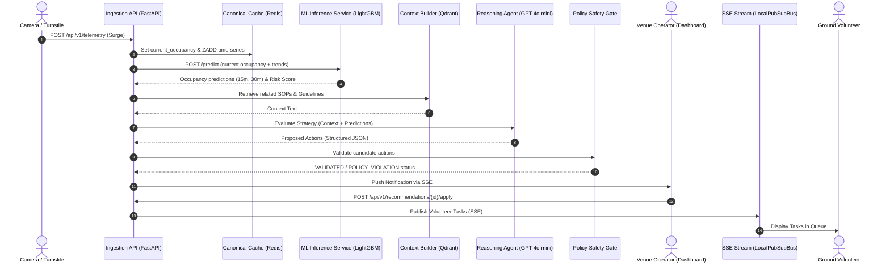

# Architecture Design & Sequence Flows

FIFA Nexus AI is an event-driven, proactive operational intelligence platform that monitors crowd densities, predicts bottlenecks, and dispatches safety-validated recommendations.

## Component Overview

1. **Ingestion Gateway (FastAPI)**: Accepts high-frequency turnstile/camera telemetry, persists to PostgreSQL event store, and caches state in Redis.
2. **Predictive Engine (LightGBM)**: Predicts zone occupancies 15-30 minutes into the future based on sliding-window timeseries history.
3. **Context Builder (RAG)**: Combines live zone occupancy metrics, predicted trends, and related security/SOP protocols retrieved from Qdrant Vector database.
4. **AI Reasoning Agent (GPT-4o-mini)**: Explores candidate responses, evaluates impact, and proposes structured action plans.
5. **Multi-Objective Optimizer**: Ranks candidate actions using a mathematical weight function scoring risk, cost, and effectiveness.
6. **Deterministic Safety Gate**: Intercepts AI proposals, validates them against static crowd/security rule policies, and blocks any violations.
7. **Task Dispatcher**: Publishes approved actions to ground volunteer teams via Server-Sent Events (SSE).

## Telemetry to Task Dispatch Sequence Flow

