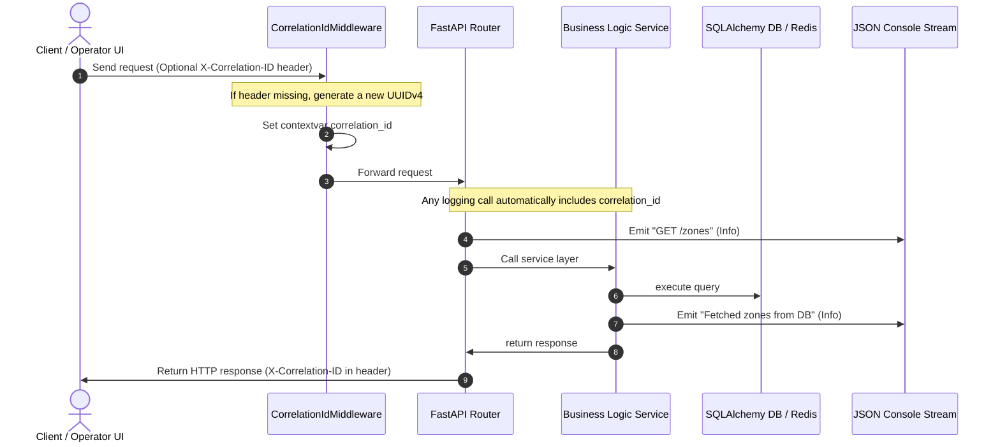

# Logging Architecture & Lifecycle — FIFA Nexus AI

This document outlines the structured logging architecture, the Correlation ID tracking flow, and the lifecycle of structured logs across the FIFA Nexus AI platform.

---

## 1. Correlation ID Propagation Flow

To trace a single logical request across multi-layer calls (FastAPI routers, services, DB transactions, and ML microservices), the application enforces a strict **Correlation ID Propagation Pattern** using the `CorrelationIdMiddleware` defined in `backend/app/core/logging.py`.



---

## 2. Request Lifecycle & Log Collection

1. **Ingress**: A request enters the ASGI server. The `CorrelationIdMiddleware` intercepts it, checks for `X-Correlation-ID` in the request headers, and initializes the contextual tracking variable.
2. **Context Binding**: The tracking context is bound to the async task execution context using Python's `contextvars`. This ensures thread-safe and async-safe isolation of logs for parallel requests.
3. **Execution & Logging**: Every call to `logger.info`, `logger.warning`, or `logger.error` formats the output into a single-line JSON structure, extracting the active correlation ID.
4. **Egress**: The `CorrelationIdMiddleware` appends `X-Correlation-ID` to the outgoing HTTP headers, allowing client-side tracking and debug referencing.

---

## 3. Structured Log Format

All logs emitted in production are structured in a single-line JSON format. This format integrates directly with cloud log aggregators (e.g., Datadog, ELK stack, AWS CloudWatch, or Render logs).

### Log Schema Fields

| Field Name | Type | Description |
|---|---|---|
| `timestamp` | `string` | UTC ISO-8601 formatted timestamp with millisecond precision |
| `level` | `string` | Log severity level (`INFO`, `WARNING`, `ERROR`, `CRITICAL`, `DEBUG`) |
| `message` | `string` | Human-readable log event details |
| `module` | `string` | Name of the Python module or subsystem emitting the log |
| `correlation_id` | `string` | The UUIDv4 associated with the HTTP request lifecycle |

### Example JSON Log Output

#### Nominal Request Log
```json
{
  "timestamp": "2026-07-10T01:45:12.384Z",
  "level": "INFO",
  "message": "Processed telemetry ingestion for Zone: Gate A (Count: 15)",
  "module": "backend.app.api.v1.telemetry",
  "correlation_id": "4da78ef1-92b5-4b92-8069-7df9a0ea1211"
}
```

#### Warning / Heuristic Fallback Activation Log
```json
{
  "timestamp": "2026-07-10T01:45:14.912Z",
  "level": "WARNING",
  "message": "ML Prediction service connection failed: HTTP 503. Executing local fallback engine.",
  "module": "backend.app.services.predict",
  "correlation_id": "8ea9a0bb-23ba-4211-9a77-3382711fa980"
}
```

#### Exception / System Error Log
```json
{
  "timestamp": "2026-07-10T01:45:15.104Z",
  "level": "ERROR",
  "message": "Database transaction rollback triggered. Commit failed: DB connection closed.",
  "module": "backend.app.core.database",
  "correlation_id": "8ea9a0bb-23ba-4211-9a77-3382711fa980"
}
```
